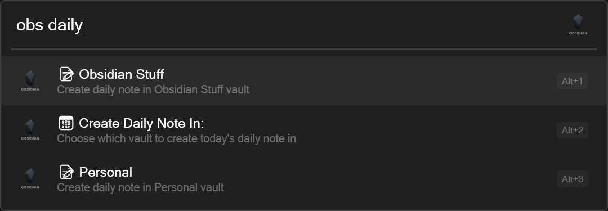

# ObsidianFlowLauncher

A powerful Flow Launcher plugin for accessing and managing your Obsidian notes and vaults directly from Flow Launcher.



## Features

### 🏠 Vault Management
- **Automatic Vault Discovery**: Automatically finds all your Obsidian vaults on your system
- **Vault Opening**: Open any vault directly from Flow Launcher
- **Multi-Vault Support**: Seamlessly work with multiple Obsidian vaults

### 📝 Daily Notes
- **Smart Daily Note Creation**: Create daily notes with vault-specific templates and formats
- **Template Integration**: Uses your Obsidian's configured daily note templates
- **Custom Date Formats**: Supports Obsidian's date format system (MMM DD YYYY, etc.)
- **Organized Storage**: Places daily notes in the configured folder and sorts them chronologically

### 🔍 Quick Actions
- **Vault Selection**: Interactive menu for daily note creation when multiple vaults exist
- **Instant Opening**: Notes open immediately in Obsidian after creation
- **Template Processing**: Automatic variable substitution ({{title}}, {{date}}, {{time}})

## Installation

1. Download the plugin files (`main.py`, `plugin.json`, `obsidian_icon.png`)
2. Place them in your Flow Launcher plugins directory:
   - `%APPDATA%\FlowLauncher\app-1.20.2\UserData\Plugins\Obsidian\`
3. Restart Flow Launcher
4. Use the keyword `obs` to start using the plugin

## Usage

### Basic Commands

| Command | Description |
|---------|-------------|
| `obs` | Show plugin status and available vaults |
| `obs daily` | Create a daily note |
| `obs open [vault name]` | Open a specific vault |

### Examples

- `obs` → Shows all found vaults and plugin status
- `obs daily` → Creates a daily note in your default vault
- `obs daily Personal` → Creates a daily note in the "Personal" vault

## Configuration

The plugin automatically reads your Obsidian vault configurations from `.obsidian/daily-notes.json` files:

```json
{
  "format": "MMM DD YYYY",
  "folder": "01 - Daily Note",
  "template": "04 - Support/Template/Daily Note Template"
}
```

### Supported Template Variables

- `{{title}}` - The note title
- `{{date}}` - Current date (YYYY-MM-DD format)
- `{{time}}` - Current time (HH:MM format)
- `{{date:YYYY-MM-DD}}` - Date in specific format
- `{{date:MMM DD YYYY}}` - Date in Obsidian format

## How It Works

### Vault Discovery
1. Scans common Obsidian installation paths
2. Looks for `.obsidian` folders to identify vaults
3. Reads vault configurations and metadata
4. Supports both registered and unregistered vaults

### Daily Note Creation
1. Reads vault's `daily-notes.json` configuration
2. Applies the specified date format
3. Uses the configured template file
4. Places note in the specified folder
5. Opens the note immediately in Obsidian

### Template Processing
1. Finds template file (supports both `.md` and non-`.md` extensions)
2. Processes template variables
3. Generates final note content
4. Falls back to default template if custom template not found

## Requirements

- **Flow Launcher**: v1.20.2 or later
- **Obsidian**: Any version
- **Python**: 3.6+ (included with Flow Launcher)

## Development

### Project Structure
```
ObsidianFlowLauncher/
├── main.py              # Main plugin code
├── plugin.json          # Plugin configuration
├── obsidian_icon.png    # Plugin icon
└── README.md           # This file
```

### Key Classes

- **ObsidianPlugin**: Main plugin class handling all functionality
- **Vault Discovery**: Automatic finding and caching of Obsidian vaults
- **Daily Notes**: Template-based note creation with format conversion
- **Template Processing**: Variable substitution and content generation

## Contributing

1. Fork the repository
2. Create a feature branch
3. Make your changes
4. Test thoroughly
5. Submit a pull request

## License

This project is licensed under the MIT License - see the [LICENSE](LICENSE) file for details.

## Credits

- Developed for Flow Launcher community
- Inspired by existing Flow Launcher plugins
- Built with Python and Flow Launcher's JSON-RPC API

## Support

If you encounter any issues or have feature requests, please open an issue on GitHub or submit a pull request.

---

**Made with ❤️ for the Obsidian and Flow Launcher communities**